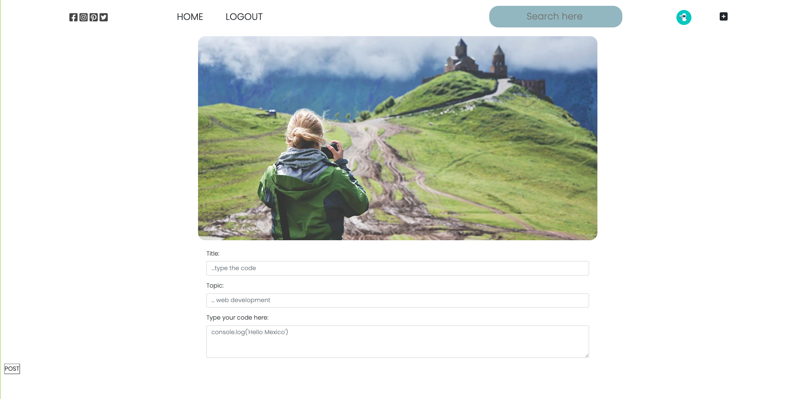
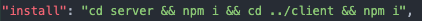
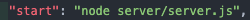

<h1 align="center">
CODE SNIPER 💻🚀
</h1> 

# DESCRIPTION:
#### Weclome to Code Sniper, a user friendly social media app for all type of developers. In it you will be able ton share your code and follow your trends. Developed by frustrated students that wanted to share their code. Create a profile, follow other coders and share all your code snipets. 

# APP ACCESS:
#### Deployed URL: https://still-chamber-42871.herokuapp.com/

# USER GUIDE: 
#### Fill the inputs and then add the information by posting it. 

# HOW TO RUN THE CODE:
#### In case you open it from a code editor:
# Open your terminal and run'npm run install'.
 

# Open your terminal and run'npm run start'.
 

# The Github Repository is:

https://github.com/aeklf/CodeSniper

# Please reach out to the following email:

### CREDITS:

**Daniel Olmedo:** [https://github.com/DanOlmedo](https://github.com/DanOlmedo)

**Mario Acosta:** [https://github.com/macosta2015](https://github.com/macosta2015)

**Cuitlahuac Maldonado:** [https://github.com/KuiiMaldonado](https://github.com/KuiiMaldonado)

**Alexis García:** [https://github.com/lexosaur](https://github.com/lexosaur)

**Andrea Kalife:** [https://github.com/aeklf](https://github.com/aeklf)

**Carolina García:** [https://github.com/CaroGTaboada](https://github.com/CaroGTaboada)

### LICENSE:
#### MIT

**© 2022 Cuitlahuac Maldonado, Alexis García, Daniel Olmedo, Carolina García, Mario Acosta**
